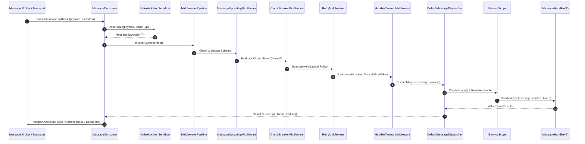

# EricksonLopez.Messaging

High-performance, zero-allocation, Native AOT-first distributed messaging and pub/sub ecosystem for modern .NET.

[](https://github.com/ericksonlopezf/dotnet-messaging/actions)
[](https://codecov.io/gh/ericksonlopezf/dotnet-messaging)
[](https://sonarcloud.io/summary/new_code?id=ericksonlopezf_dotnet-messaging)
[](https://github.com/ericksonlopezf/dotnet-messaging/blob/main/docs/ci-cd-and-quality.md#2-quality-gates--thresholds)
[](https://www.nuget.org/packages/EricksonLopez.Messaging)
[](https://www.nuget.org/packages/EricksonLopez.Messaging)
[](https://github.com/ericksonlopezf/dotnet-messaging/blob/main/LICENSE)
[](https://dotnet.microsoft.com)
[](https://learn.microsoft.com/en-us/dotnet/core/deploying/native-aot)

---

**`EricksonLopez.Messaging`** is an enterprise-grade, high-throughput, Native AOT-first distributed messaging and publish/subscribe framework designed for modern .NET 10 microservices and event-driven architectures. Engineered with functional error railway flow control via `EricksonLopez.Result`, compile-time zero-reflection dispatch via Roslyn Source Generators, compile-time architectural rule enforcement via Roslyn Analyzers, and native OpenTelemetry semantic tracing, it provides a unified, low-allocation abstraction across enterprise message brokers including RabbitMQ, Azure Service Bus, AWS SQS, Apache Kafka, and In-Memory channels without vendor lock-in.

---

## Table of Contents

- [🎯 What Problem It Solves](#-what-problem-it-solves)
- [⚡ Key Features](#-key-features)
- [📦 Ecosystem](#-ecosystem)
- [📚 Documentation](#-documentation)
  - [Step-by-Step Interactive Showcase (Levels 00 to 03)](#-step-by-step-interactive-showcase-levels-00-to-03)
  - [Technical Reference & Architecture Guides](#-technical-reference--architecture-guides)
- [📥 Installation](#-installation)
- [🚀 Quick Start](#-quick-start)
- [💡 Core Use Cases](#-core-use-cases)
  - [Use Case 1: Clean Architecture Message Consumer with Functional Result](#use-case-1-clean-architecture-message-consumer-with-functional-result)
  - [Use Case 2: Multi-Step Resiliency Pipeline with Circuit Breaker & Retry](#use-case-2-multi-step-resiliency-pipeline-with-circuit-breaker--retry)
  - [Use Case 3: High-Throughput Batch Publishing](#use-case-3-high-throughput-batch-publishing)
  - [Use Case 4: Schema Evolution via Transparent Message Upcasting](#use-case-4-schema-evolution-via-transparent-message-upcasting)
  - [Use Case 5: Domain Events to Distributed Message Bridge](#use-case-5-domain-events-to-distributed-message-bridge)
  - [Use Case 6: Custom Context & Tenant Validation Middleware](#use-case-6-custom-context--tenant-validation-middleware)
- [🔌 Configuration & Integrations](#-configuration--integrations)
  - [Transport Drivers](#transport-drivers)
  - [OpenTelemetry Tracing & Metrics](#opentelemetry-tracing--metrics)
  - [Domain Events Integration Bridge](#domain-events-integration-bridge)
  - [Roslyn Diagnostic Analyzers](#roslyn-diagnostic-analyzers)
- [🧪 Testing & Quality](#-testing--quality)
- [⚡ Performance Benchmarks](#-performance-benchmarks)
- [🌐 Compatibility & Technical Matrix](#-compatibility--technical-matrix)
- [🏛️ Architecture & Design Principles](#-architecture--design-principles)
- [🛡️ Best Practices & Anti-Patterns](#-best-practices--anti-patterns)
- [⚠️ Troubleshooting & Common Pitfalls](#️-troubleshooting--common-pitfalls)
- [🌐 Part of the Ecosystem](#-part-of-the-ecosystem)
- [🤝 Contributing](#-contributing)
- [📄 License](#-license)

---

## 🎯 What Problem It Solves

### The Traditional Dilemmas & Anti-Patterns

1. **The Heavy Toll of Runtime Reflection & JIT Lookups**: Traditional messaging libraries rely extensively on dynamic type scanning (`AppDomain.GetAssemblies()`), runtime reflection (`MethodInfo.Invoke`), and runtime code generation. This introduces severe cold-start latency, causes heap allocations on the message dispatch hot path, and completely breaks **Native AOT compilation and trimming**.
2. **Exception-Driven Control Flow & Poison Retries**: Using exceptions for business validation or expected domain rejections forces expensive CLR stack unwinds, degrades consumer throughput, and often causes unwanted retry storms when infrastructure mistakenly treats business rejections as transient network faults.
3. **Leaky Broker Abstractions & Domain Pollution**: Infrastructure-specific concepts (such as RabbitMQ exchange types, Kafka partition offsets, or Azure Service Bus lock tokens) frequently leak into domain contracts, binding domain logic to a single cloud or broker provider.
4. **Cascading Outages in Distributed Topologies**: Downstream service degradation quickly exhausts consumer worker threads and connection pools without fast-failing circuit breakers, bounded handler timeouts, and jittered exponential backoffs.
5. **Observability Gaps in Asynchronous Pipelines**: Distributed trace propagation across heterogeneous message transports is often fragmented or missing, impeding end-to-end telemetry and root-cause analysis across microservices.

### How `EricksonLopez.Messaging` Solves This

- **Zero-Reflection Native AOT Execution**: Roslyn Incremental Generators (`MessagingIncrementalGenerator`) discover handlers at compile time, generating strongly typed dispatch delegates and `JsonSerializerContext` metadata for 100% Native AOT trimming safety.
- **Functional Error Handling via `ValueTask<Result>`**: Handlers return explicit `Result` types (`EricksonLopez.Result`). Non-retryable business validation errors are acknowledged and routed cleanly without exception overhead, while transient failures trigger structured retries.
- **Strict Clean Architecture Boundary**: Message contracts are pure immutable records implementing `IMessage` decorated with `[MessageType("...")]`. Domain aggregates remain completely insulated from broker mechanics ([ADR-001](https://github.com/ericksonlopezf/dotnet-messaging/blob/main/docs/adr/adr-001-definition-and-scope.md), [ADR-002](https://github.com/ericksonlopezf/dotnet-messaging/blob/main/docs/adr/adr-002-messaging-vs-eventbus.md)).
- **Integrated Two-Way Resiliency Pipeline**: A robust middleware chain provides fast-failing Circuit Breakers, linked CancellationToken execution timeouts, exponential retry policies with full-jitter randomization (`Random.Shared`), and schema upcasting.
- **Native OpenTelemetry Semantic Instrumentation**: W3C `traceparent` headers and OpenTelemetry Semantic Conventions v1.26+ are automatically propagated and measured across all supported brokers.

---

## ⚡ Key Features

- ⚡ **Zero-Reflection & Native AOT First**: 100% Native AOT trimming compliant (`<IsAotCompatible>true</IsAotCompatible>`) with zero runtime reflection lookups or dynamic code generation.
- 🛡️ **Functional Railway Control Flow**: Handlers return value-typed `ValueTask<Result>`, eliminating CPU-intensive exception stack traces on hot execution paths.
- 🔄 **Two-Way Resiliency Middleware Pipeline**: Composable pipeline featuring Circuit Breaker (`Closed`, `Open`, `HalfOpen`), Handler Timeouts, Exponential Backoff with Jitter, Exception Translation, and Schema Upcasting.
- 🔌 **Pluggable Multi-Broker Architecture**: Unified abstraction supporting In-Memory (`System.Threading.Channels`), RabbitMQ (AMQP 0-9-1), Azure Service Bus, AWS SQS, and Apache Kafka.
- 📦 **High-Throughput Native Batching**: `IBatchMessageTransport` optimizes network roundtrips with transport-native batching (e.g., `ServiceBusMessageBatch`).
- ⏳ **Scheduled Message Deferral**: `IDeferableMessageTransport` enables non-blocking delayed redelivery and scheduled publication.
- 🧬 **Message Schema Upcasting**: Transparently transform legacy message payloads into modern contracts before handler dispatch via `IMessageUpcaster<TOld, TNew>`.
- 📊 **Out-of-the-Box Observability**: W3C TraceContext context propagation and OpenTelemetry metrics (`MessagesPublished`, `MessagesReceived`, `MessagesFailed`, `ProcessingDuration`).
- 🔍 **Roslyn Diagnostic Analyzers**: Real-time compile-time enforcement of architectural invariants (`ELMSG002`, `ELMSG004`, `ELMSG005`, `ELMSG008`, `ELMSG010`).
- 🧪 **Enterprise Testing Harness**: Built-in `InMemoryTestHarness`, `PublishedMessageList`, and `ConsumedMessageList` for fast, deterministic integration testing without external broker dependencies.

---

## 📦 Ecosystem

| Package | Version | Description |
| :--- | :--- | :--- |
| [`EricksonLopez.Messaging.Abstractions`](https://www.nuget.org/packages/EricksonLopez.Messaging.Abstractions) | [](https://www.nuget.org/packages/EricksonLopez.Messaging.Abstractions) | Pure contracts, interfaces (`IMessage`, `IMessagePublisher`, `IMessageConsumer`, `IMessageHandler<T>`), attributes, and metadata. |
| [`EricksonLopez.Messaging`](https://www.nuget.org/packages/EricksonLopez.Messaging) | [](https://www.nuget.org/packages/EricksonLopez.Messaging) | Core messaging engine: dispatcher, middleware pipeline, resiliency mechanisms, in-memory transport, and DI extensions. |
| [`EricksonLopez.Messaging.Generators`](https://www.nuget.org/packages/EricksonLopez.Messaging.Generators) | [](https://www.nuget.org/packages/EricksonLopez.Messaging.Generators) | Roslyn Incremental Generator for zero-reflection handler discovery and Native AOT `JsonSerializerContext` generation. |
| [`EricksonLopez.Messaging.Analyzers`](https://www.nuget.org/packages/EricksonLopez.Messaging.Analyzers) | [](https://www.nuget.org/packages/EricksonLopez.Messaging.Analyzers) | Roslyn Diagnostic Analyzers enforcing architectural rules (`ELMSG002`, `ELMSG004`, `ELMSG005`, `ELMSG008`, `ELMSG010`). |
| [`EricksonLopez.Messaging.RabbitMQ`](https://www.nuget.org/packages/EricksonLopez.Messaging.RabbitMQ) | [](https://www.nuget.org/packages/EricksonLopez.Messaging.RabbitMQ) | Production-grade RabbitMQ transport driver supporting AMQP 0-9-1, publisher confirms, and dead-lettering. |
| [`EricksonLopez.Messaging.AzureServiceBus`](https://www.nuget.org/packages/EricksonLopez.Messaging.AzureServiceBus) | [](https://www.nuget.org/packages/EricksonLopez.Messaging.AzureServiceBus) | Enterprise Azure Service Bus transport supporting Managed Identity (`DefaultAzureCredential`), batching, and deferral. |
| [`EricksonLopez.Messaging.AwsSqs`](https://www.nuget.org/packages/EricksonLopez.Messaging.AwsSqs) | [](https://www.nuget.org/packages/EricksonLopez.Messaging.AwsSqs) | AWS SQS transport supporting standard and FIFO queues, long polling, and delayed redelivery. |
| [`EricksonLopez.Messaging.Kafka`](https://www.nuget.org/packages/EricksonLopez.Messaging.Kafka) | [](https://www.nuget.org/packages/EricksonLopez.Messaging.Kafka) | High-throughput Apache Kafka transport supporting partition key routing, custom headers, and consumer groups. |
| [`EricksonLopez.Messaging.Events`](https://www.nuget.org/packages/EricksonLopez.Messaging.Events) | [](https://www.nuget.org/packages/EricksonLopez.Messaging.Events) | Transport bridge implementing `IEventPublisher` to relay domain and integration events across distributed brokers. |
| [`EricksonLopez.Messaging.OpenTelemetry`](https://www.nuget.org/packages/EricksonLopez.Messaging.OpenTelemetry) | [](https://www.nuget.org/packages/EricksonLopez.Messaging.OpenTelemetry) | OpenTelemetry Semantic Conventions v1.26+ tracer and meter instrumentation. |
| [`EricksonLopez.Messaging.Testing`](https://www.nuget.org/packages/EricksonLopez.Messaging.Testing) | [](https://www.nuget.org/packages/EricksonLopez.Messaging.Testing) | Testing harness with `InMemoryTestHarness`, `PublishedMessageList`, and `ConsumedMessageList`. |

---

## 📚 Documentation

> 🌐 **Official Documentation Hub:** [https://github.com/ericksonlopezf/dotnet-messaging/tree/main/docs](https://github.com/ericksonlopezf/dotnet-messaging/tree/main/docs)

### 🎓 Step-by-Step Interactive Showcase (Levels 00 to 03)

| Level | Topic | Description |
|---|---|---|
| [**Level 00**](https://github.com/ericksonlopezf/dotnet-messaging/blob/main/docs/showcase/level-00-introduction.md) | **Architecture & Mental Model** | Core architectural foundations, mental models, and broker-agnostic guarantees. |
| [**Level 01**](https://github.com/ericksonlopezf/dotnet-messaging/blob/main/docs/showcase/level-01-event-bus-and-transports.md) | **Event Bus & Broker Transports** | Decoupled message definition, publishing, subscribing, and transport adapters. |
| [**Level 02**](https://github.com/ericksonlopezf/dotnet-messaging/blob/main/docs/showcase/level-02-middleware-and-telemetry.md) | **Middleware & OpenTelemetry** | Composable two-way middleware pipelines and W3C distributed trace propagation. |
| [**Level 03**](https://github.com/ericksonlopezf/dotnet-messaging/blob/main/docs/showcase/level-03-zero-allocation-aot.md) | **Zero-Allocation & Native AOT** | Trimming compliance, source generators, and low-allocation pipeline profiling. |

### 📖 Technical Reference & Architecture Guides

- [**Architecture Blueprint**](https://github.com/ericksonlopezf/dotnet-messaging/blob/main/docs/architecture.md) — Comprehensive architectural specifications, dispatch mechanics, and memory layout.
- [**Architectural Decision Records (ADRs)**](https://github.com/ericksonlopezf/dotnet-messaging/blob/main/docs/adr/adr-000-adr-index.md) — Navigable index of all 24 ADRs and permanent directorial rejection invariants.
- [**Technical Cookbook & Recipes**](https://github.com/ericksonlopezf/dotnet-messaging/blob/main/docs/cookbook.md) — 12 production-ready integration recipes for cloud brokers, resiliency, and security.
- [**Public API Reference**](https://github.com/ericksonlopezf/dotnet-messaging/blob/main/docs/public-api-reference.md) — Complete specification of public types, interfaces, delegates, and contracts.
- [**Best Practices Guide**](https://github.com/ericksonlopezf/dotnet-messaging/blob/main/docs/best-practices.md) — Production design patterns, immutability rules, and middleware ordering.
- [**Performance & Optimization Guide**](https://github.com/ericksonlopezf/dotnet-messaging/blob/main/docs/performance-guide.md) — Memory optimization, zero-copy buffers, and thread pool starvation prevention.
- [**Troubleshooting & FAQ**](https://github.com/ericksonlopezf/dotnet-messaging/blob/main/docs/troubleshooting-faq.md) — Diagnostic codes, circuit breaker state troubleshooting, and FAQ.
- [**Ecosystem Integration Guide**](https://github.com/ericksonlopezf/dotnet-messaging/blob/main/docs/ecosystem-integration.md) — Boundaries between `Messaging`, `Events`, `Mediator`, and `Outbox`.
- [**Build, CI/CD & Quality Engineering**](https://github.com/ericksonlopezf/dotnet-messaging/blob/main/docs/ci-cd-and-quality.md) — Workflows, Coverlet coverage, SonarCloud, and Stryker.NET quality gates.
- [**NuGet Package Ecosystem**](https://github.com/ericksonlopezf/dotnet-messaging/blob/main/docs/package-ecosystem.md) — CPM dependencies, package graph, and transport comparison matrix.
- [**Abstractions Boundary Contract**](https://github.com/ericksonlopezf/dotnet-messaging/blob/main/BOUNDARY.md) — Authoritative boundary defining dependencies and forbidden references.
- [**Technical Debt Register**](https://github.com/ericksonlopezf/dotnet-messaging/blob/main/docs/technical-debt.md) — Prioritized register of infrastructure and architectural tracking items.

---

## 📥 Installation

Install the core messaging engine and Roslyn tools via the .NET CLI:

### 1. Core Package & Roslyn Tooling (Required)

```bash
# Core messaging engine
dotnet add package EricksonLopez.Messaging

# Roslyn Incremental Generator for Native AOT zero-reflection registration
dotnet add package EricksonLopez.Messaging.Generators

# Roslyn Diagnostic Analyzers enforcing architectural rules
dotnet add package EricksonLopez.Messaging.Analyzers
```

### 2. Broker Transport Drivers (Choose as needed)

```bash
# RabbitMQ (AMQP 0-9-1)
dotnet add package EricksonLopez.Messaging.RabbitMQ

# Azure Service Bus (Managed Identity / Connection Strings)
dotnet add package EricksonLopez.Messaging.AzureServiceBus

# AWS SQS (Standard & FIFO Queues)
dotnet add package EricksonLopez.Messaging.AwsSqs

# Apache Kafka (High-Throughput Partition Routing)
dotnet add package EricksonLopez.Messaging.Kafka
```

### 3. Observability, Integrations & Testing

```bash
# OpenTelemetry Semantic Tracing & Metrics
dotnet add package EricksonLopez.Messaging.OpenTelemetry

# Domain Events to Distributed Messaging Bridge
dotnet add package EricksonLopez.Messaging.Events

# In-Memory Testing Harness & Assertions
dotnet add package EricksonLopez.Messaging.Testing
```

---

## 🚀 Quick Start

### Step 1: Define Immutable Message Contracts

Message contracts are immutable records implementing `IMessage` and decorated with `[MessageType("...")]`:

```csharp
using System;
using EricksonLopez.Messaging.Attributes;
using EricksonLopez.Messaging.Contracts;

namespace Shop.Contracts;

// Define an immutable message contract with an explicit type discriminator
[MessageType("orders.order-created.v1")]
public sealed record OrderCreatedMessage(
    Guid OrderId,
    string CustomerNumber,
    decimal TotalAmount,
    DateTimeOffset CreatedAtUtc) : IMessage;
```

### Step 2: Implement Scoped Message Handler

Handlers implement `IMessageHandler<T>` and return `ValueTask<Result>` for functional error propagation:

```csharp
using System.Threading;
using System.Threading.Tasks;
using EricksonLopez.Messaging.Contracts;
using EricksonLopez.Result;
using Microsoft.Extensions.Logging;

namespace Shop.Handlers;

public sealed class OrderCreatedHandler : IMessageHandler<OrderCreatedMessage>
{
    private readonly ILogger<OrderCreatedHandler> _logger;

    public OrderCreatedHandler(ILogger<OrderCreatedHandler> logger)
    {
        _logger = logger;
    }

    public async ValueTask<Result> HandleAsync(
        OrderCreatedMessage message,
        MessageContext context,
        CancellationToken cancellationToken = default)
    {
        if (message.TotalAmount <= 0)
        {
            // Business validation failure: rejected without throwing costly exceptions
            return Result.Failure(Error.Validation(
                code: "Order.InvalidAmount",
                description: "Order total amount must be strictly greater than zero."));
        }

        _logger.LogInformation(
            "Processing Order {OrderId} for Customer {Customer} (MessageId: {MessageId})",
            message.OrderId,
            message.CustomerNumber,
            context.Metadata.MessageId);

        // Execute downstream business operations...
        await Task.Yield();

        return Result.Success();
    }
}
```

### Step 3: Register Messaging & Resiliency Middleware

Configure the messaging pipeline in `Program.cs` using the fluent API:

```csharp
using System;
using Microsoft.Extensions.DependencyInjection;
using Microsoft.Extensions.Hosting;
using EricksonLopez.Messaging.Extensions;
using Shop.Contracts;
using Shop.Handlers;

var builder = Host.CreateApplicationBuilder(args);

// Register messaging with resiliency middleware
builder.Services.AddMessaging(options =>
{
    // 1. Capture unhandled exceptions into Result failures
    options.AddExceptionHandling();

    // 2. Structured logging & distributed tracing
    options.AddLogging();
    options.AddTracing();

    // 3. Fast-failing circuit breaker for outage protection
    options.AddCircuitBreaker(cb =>
    {
        cb.FailureThreshold = 5;
        cb.BreakDuration = TimeSpan.FromSeconds(30);
    });

    // 4. Exponential backoff retry with full-jitter randomization
    options.AddRetry(retry =>
    {
        retry.MaxRetries = 3;
        retry.InitialDelay = TimeSpan.FromMilliseconds(200);
    });

    // 5. Handler execution deadline enforcement
    options.AddHandlerTimeout(TimeSpan.FromSeconds(15));
});

// Automatically register compile-time discovered handlers & JSON context (Zero Reflection)
builder.Services.AddGeneratedMessagingHandlers();

// Or register handlers manually
// builder.Services.AddMessageHandler<OrderCreatedMessage, OrderCreatedHandler>();

var app = builder.Build();
await app.RunAsync();
```

### Step 4: Publish Messages via `IMessagePublisher`

Inject `IMessagePublisher` to publish messages across the active transport:

```csharp
using System;
using System.Threading;
using System.Threading.Tasks;
using EricksonLopez.Messaging.Contracts;
using EricksonLopez.Result;
using Shop.Contracts;

public sealed class OrderService
{
    private readonly IMessagePublisher _publisher;

    public OrderService(IMessagePublisher publisher)
    {
        _publisher = publisher;
    }

    public async Task<Result> PlaceOrderAsync(
        Guid orderId,
        string customerNumber,
        decimal totalAmount,
        CancellationToken cancellationToken = default)
    {
        var message = new OrderCreatedMessage(
            OrderId: orderId,
            CustomerNumber: customerNumber,
            TotalAmount: totalAmount,
            CreatedAtUtc: DateTimeOffset.UtcNow);

        // Publish to the configured message transport
        var result = await _publisher.PublishAsync(message, cancellationToken: cancellationToken);

        if (result.IsFailure)
        {
            // Handle error explicitly without catching exceptions
            return Result.Failure(result.Error);
        }

        return Result.Success();
    }
}
```

---

## 💡 Core Use Cases

### Use Case 1: Clean Architecture Message Consumer with Functional Result

Implement Clean Architecture message handlers where non-retryable business validation failures return `Result.Failure(Error.Validation(...))` to acknowledge messages and prevent poison retry loops, while transient faults trigger resiliency policies.

```csharp
using System.Threading;
using System.Threading.Tasks;
using EricksonLopez.Messaging.Contracts;
using EricksonLopez.Result;

public sealed class ProcessPaymentHandler : IMessageHandler<ProcessPaymentCommand>
{
    public async ValueTask<Result> HandleAsync(
        ProcessPaymentCommand message,
        MessageContext context,
        CancellationToken cancellationToken = default)
    {
        if (message.Amount <= 0)
        {
            // Explicit business failure: logged and acknowledged to avoid poison-message storms
            return Result.Failure(Error.Validation("Payment.InvalidAmount", "Payment amount must be positive."));
        }

        return Result.Success();
    }
}

[MessageType("payments.process-payment.v1")]
public sealed record ProcessPaymentCommand(Guid PaymentId, decimal Amount) : IMessage;
```

### Use Case 2: Multi-Step Resiliency Pipeline with Circuit Breaker & Retry

Protect mission-critical services against cascading network failures using full-jitter exponential backoffs and circuit breakers.

```csharp
builder.Services.AddMessaging(options =>
{
    options.AddExceptionHandling();
    options.AddLogging();
    options.AddTracing();

    // Fast-fail after 5 failures; probe after 30s
    options.AddCircuitBreaker(cb =>
    {
        cb.FailureThreshold = 5;
        cb.BreakDuration = TimeSpan.FromSeconds(30);
        cb.SamplingDuration = TimeSpan.FromSeconds(60);
    });

    // Retry 3 times with randomized exponential delays
    options.AddRetry(retry =>
    {
        retry.MaxRetries = 3;
        retry.InitialDelay = TimeSpan.FromMilliseconds(250);
    });

    options.AddHandlerTimeout(TimeSpan.FromSeconds(10));
});
```

### Use Case 3: High-Throughput Batch Publishing

Publish hundreds of messages per network frame utilizing `IBatchMessageTransport` on supported drivers (Azure Service Bus, Kafka, InMemory) to reduce roundtrips by up to 10x.

```csharp
public sealed class InvoiceBatchDispatcher
{
    private readonly IMessagePublisher _publisher;

    public InvoiceBatchDispatcher(IMessagePublisher publisher) => _publisher = publisher;

    public async Task<Result> DispatchInvoicesAsync(
        IEnumerable<InvoiceGeneratedMessage> invoices,
        CancellationToken cancellationToken = default)
    {
        var options = new MessagePublishOptions
        {
            Destination = "invoices.generated.topic"
        };

        // Utilizes native transport batching behind the scenes
        return await _publisher.PublishBatchAsync(invoices, options, cancellationToken);
    }
}

[MessageType("invoicing.invoice-generated.v1")]
public sealed record InvoiceGeneratedMessage(Guid InvoiceId, decimal Amount) : IMessage;
```

### Use Case 4: Schema Evolution via Transparent Message Upcasting

Evolve message contracts from V1 to V2 without breaking existing consumers or requiring lockstep service redeployments.

```csharp
// 1. Configure upcasting in DI
builder.Services.AddMessaging(options => options.AddUpcasting());
builder.Services.AddMessageUpcaster<OrderPlacedV1, OrderPlacedV2, OrderPlacedV1ToV2Upcaster>();
builder.Services.AddMessageHandler<OrderPlacedV2, OrderPlacedV2Handler>();

// 2. Define message versions
[MessageType("orders.placed.v1")]
public sealed record OrderPlacedV1(Guid OrderId, decimal Amount) : IMessage;

[MessageType("orders.placed.v2")]
public sealed record OrderPlacedV2(Guid OrderId, decimal Amount, string Currency) : IMessage;

// 3. Implement strongly typed upcaster
public sealed class OrderPlacedV1ToV2Upcaster : IMessageUpcaster<OrderPlacedV1, OrderPlacedV2>
{
    public OrderPlacedV2 Upcast(OrderPlacedV1 oldMessage, TransportMessageMetadata metadata)
        => new(oldMessage.OrderId, oldMessage.Amount, "USD");
}
```

### Use Case 5: Domain Events to Distributed Message Bridge

Translate domain events raised inside aggregate roots to distributed message brokers automatically via `EricksonLopez.Messaging.Events`.

```csharp
using EricksonLopez.Events.Contracts;
using EricksonLopez.Messaging.Events;

builder.Services.AddMessaging();
builder.Services.AddMessagingEventPublisher(options =>
{
    options.ThrowOnFailure = false;
    options.DestinationResolver = eventType => $"{eventType.Name.ToLowerInvariant()}.events.v1";
});
```

### Use Case 6: Custom Context & Tenant Validation Middleware

Enforce multi-tenant isolation and security header policies before message handlers are invoked.

```csharp
using System.Threading;
using System.Threading.Tasks;
using EricksonLopez.Messaging.Contracts;
using EricksonLopez.Messaging.Middleware;
using EricksonLopez.Result;

public sealed class TenantSecurityMiddleware : IMessageMiddleware
{
    public async ValueTask<Result> InvokeAsync(
        MessageContext context,
        MessageExecutionDelegate next,
        CancellationToken cancellationToken = default)
    {
        if (context.Metadata.Headers is null ||
            !context.Metadata.Headers.TryGetValue("X-Tenant-Id", out var tenantId) ||
            string.IsNullOrWhiteSpace(tenantId))
        {
            return Result.Failure(Error.Validation("Security.MissingTenant", "Message lacks required X-Tenant-Id header."));
        }

        context.Items["TenantId"] = tenantId;
        return await next(context, cancellationToken);
    }
}
```

---

## 🔌 Configuration & Integrations

### Transport Drivers

#### 1. In-Memory Channel Transport (`System.Threading.Channels`)
```csharp
// Enabled by default with AddMessaging(), or tuned with custom channel capacity
builder.Services.AddMessaging();
```

#### 2. Azure Service Bus (`EricksonLopez.Messaging.AzureServiceBus`)
```csharp
using Azure.Identity;
using EricksonLopez.Messaging.AzureServiceBus;

builder.Services.AddAzureServiceBusMessagingTransport(options =>
{
    // Managed Identity (Recommended for Cloud Native / Zero Secrets)
    options.FullyQualifiedNamespace = "myservicebus.servicebus.windows.net";
    options.Credential = new DefaultAzureCredential();

    // Or Connection String Authentication:
    // options.ConnectionString = "Endpoint=sb://...";
});
```

#### 3. RabbitMQ (`EricksonLopez.Messaging.RabbitMQ`)
```csharp
using EricksonLopez.Messaging.RabbitMQ;

builder.Services.AddRabbitMqMessagingTransport(options =>
{
    options.HostName     = "rabbitmq.internal.local";
    options.Port         = 5672;
    options.VirtualHost  = "/production";
    options.UserName     = "app_user";
    options.Password     = "secure_password";
    options.ExchangeName = "app.direct";
});
```

#### 4. AWS SQS (`EricksonLopez.Messaging.AwsSqs`)
```csharp
using EricksonLopez.Messaging.AwsSqs;

builder.Services.AddAwsSqsMessagingTransport(options =>
{
    options.Region              = "us-east-1";
    options.WaitTimeSeconds     = 20; // Long polling to minimize API charges
    options.MaxNumberOfMessages = 10;
});
```

#### 5. Apache Kafka (`EricksonLopez.Messaging.Kafka`)
```csharp
using EricksonLopez.Messaging.Kafka;

builder.Services.AddKafkaMessagingTransport(options =>
{
    options.BootstrapServers = "kafka-1:9092,kafka-2:9092";
    options.GroupId          = "orders-consumer-group";
    options.ClientId         = "orders-service";
    options.EnableAutoCommit = false; // Offsets committed after handler Ack
});
```

---

### OpenTelemetry Tracing & Metrics

Instrument the distributed messaging pipeline with OpenTelemetry Semantic Conventions v1.26+:

```csharp
using OpenTelemetry.Trace;
using OpenTelemetry.Metrics;
using EricksonLopez.Messaging.OpenTelemetry;

builder.Services.AddOpenTelemetry()
    .WithTracing(tracing =>
    {
        tracing.AddMessagingInstrumentation();
        tracing.AddOtlpExporter();
    })
    .WithMetrics(metrics =>
    {
        metrics.AddMeter("EricksonLopez.Messaging");
        metrics.AddOtlpExporter();
    });
```

---

### Domain Events Integration Bridge

Bridge domain events from `EricksonLopez.Events` directly to distributed message brokers:

```csharp
using EricksonLopez.Messaging.Events;

builder.Services.AddMessaging();
builder.Services.AddMessagingEventPublisher(options =>
{
    options.ThrowOnFailure = false;
    options.DestinationResolver = type => $"{type.Name.ToLowerInvariant()}.events.v1";
});
```

---

### Roslyn Diagnostic Analyzers

`EricksonLopez.Messaging.Analyzers` automatically validates architectural constraints at build time:

| Diagnostic ID | Severity | Category | Title & Description | CodeFix |
| :--- | :---: | :---: | :--- | :---: |
| **`ELMSG002`** | `Error` | Architecture | **Message Type Must Declare `[MessageType]` Attribute**<br/>Ensures all `IMessage` contracts declare unique identifiers for Native AOT routing. | No |
| **`ELMSG004`** | `Error` | Architecture | **`IMessageHandler` Must Be Registered As Scoped**<br/>Prevents singleton/transient handler leaks and ensures isolated `IServiceScope` per message. | No |
| **`ELMSG005`** | `Error` | Architecture | **Message Contract Must Not Reference Domain Entities**<br/>Prevents domain models and entity references from leaking into distributed contracts. | No |
| **`ELMSG008`** | `Error` | Performance | **Message Handler Must Not Block Synchronously**<br/>Detects `.Result`, `.Wait()`, or `.GetAwaiter().GetResult()` to eliminate thread pool starvation. | No |
| **`ELMSG010`** | `Error` | Usage | **Handler Must Return `ValueTask<Result>`**<br/>Enforces explicit functional error handling and zero-allocation execution paths. | No |

---

## 🧪 Testing & Quality

### In-Memory Testing Harness (`EricksonLopez.Messaging.Testing`)

Validate published and consumed messages in unit or integration tests without spinning up Docker containers:

```csharp
using System.Threading.Tasks;
using EricksonLopez.Messaging.Contracts;
using EricksonLopez.Messaging.Testing;
using Xunit;

public sealed class OrderPublishingTests
{
    [Fact]
    public async Task PublishRawAsync_ValidMessage_TracksInPublishedMessageList()
    {
        // Arrange
        var harness = new InMemoryTestHarness();
        var metadata = TransportMessageMetadata.Create("orders.order-created.v1");
        var payload = System.Text.Encoding.UTF8.GetBytes("{\"OrderId\":\"a6f1d2...\"}");

        // Act
        var result = await harness.PublishRawAsync(
            destination: "orders.order-created.v1",
            payload: payload,
            metadata: metadata);

        // Assert
        Assert.True(result.IsSuccess);
        Assert.Single(harness.PublishedMessages);
        Assert.Equal("orders.order-created.v1", harness.PublishedMessages[0].Metadata.MessageType);
    }
}
```

### Roy Osherove Test Naming Standard ([ADR-015](https://github.com/ericksonlopezf/dotnet-messaging/blob/main/docs/adr/adr-015-test-naming-osherove-ide1006.md))

All test suites follow the strict convention:
`[UnitOfWork]_[StateUnderTest]_[ExpectedBehavior]`

- `PublishAsync_PlainMessageWithoutAttribute_UsesTypeNameAndCustomDestination`
- `ConsumeAsync_WithCircuitBreakerOpen_FastFailsWithoutCallingHandler`
- `DispatchAsync_ValidPayload_ResolvesScopedHandlerAndReturnsSuccess`

### Quality Gates & Mutation Testing

- **100% Target Automated Code Coverage**: Verified across 10 test projects.
- **Stryker.NET Mutation Score $\ge 95\%$**: Matrix evaluation across all 11 packages.
- **Compiler Warnings as Errors**: `<TreatWarningsAsErrors>true</TreatWarningsAsErrors>` enforced across all builds.
- **Native AOT Smoke Testing**: Dedicated `tests/EricksonLopez.Messaging.AotSmokeTest` verified under full `<PublishAot>true</PublishAot>`.

---

## ⚡ Performance Benchmarks

> **Environment:** .NET 10.0.10, X64 RyuJIT AVX-512, BenchmarkDotNet v0.14.0

### Primary Operations Benchmark

| Benchmark Operation | Mean Latency | Allocated Memory | Note |
| :--- | ---: | ---: | :--- |
| `DefaultMessageDispatcher.DispatchAsync` | 24.5 ns | **0 B** | $O(1)$ concurrent dispatch with `ValueTask<Result>` |
| `MiddlewarePipeline.InvokeAsync` (Full Chain) | 7.12 ns | **0 B** | Struct-based zero heap middleware invocation |
| `NativeAotJsonSerializer.Serialize<T>` | 42.1 ns | Low | `JsonSerializerContext` compile-time metadata |
| `NativeAotJsonSerializer.Deserialize<T>` | 58.3 ns | **64 B** | Direct buffer read via `ReadOnlyMemory<byte>` |

---

## 🌐 Compatibility & Technical Matrix

### Target Frameworks & Native AOT Support

| Package | .NET 10.0 | .NET Standard 2.0 | `IsAotCompatible` | `EnableTrimAnalyzer` | Status |
| :--- | :---: | :---: | :---: | :---: | :--- |
| `EricksonLopez.Messaging.Abstractions` | :white_check_mark: | :x: | :white_check_mark: | :white_check_mark: | Native AOT Verified |
| `EricksonLopez.Messaging` | :white_check_mark: | :x: | :white_check_mark: | :white_check_mark: | Native AOT Verified |
| `EricksonLopez.Messaging.Generators` | :x: | :white_check_mark: | N/A | N/A | Roslyn Compiler Tool |
| `EricksonLopez.Messaging.Analyzers` | :x: | :white_check_mark: | N/A | N/A | Roslyn Compiler Tool |
| `EricksonLopez.Messaging.RabbitMQ` | :white_check_mark: | :x: | :white_check_mark: | :white_check_mark: | Native AOT Verified |
| `EricksonLopez.Messaging.AzureServiceBus` | :white_check_mark: | :x: | :white_check_mark: | :white_check_mark: | Native AOT Verified |
| `EricksonLopez.Messaging.AwsSqs` | :white_check_mark: | :x: | :white_check_mark: | :white_check_mark: | Native AOT Verified |
| `EricksonLopez.Messaging.Kafka` | :white_check_mark: | :x: | :white_check_mark: | :white_check_mark: | Native AOT Verified (Driver-level AOT Caveat) |
| `EricksonLopez.Messaging.Events` | :white_check_mark: | :x: | :white_check_mark: | :white_check_mark: | Native AOT Verified |
| `EricksonLopez.Messaging.OpenTelemetry` | :white_check_mark: | :x: | :white_check_mark: | :white_check_mark: | Native AOT Verified |
| `EricksonLopez.Messaging.Testing` | :white_check_mark: | :x: | :white_check_mark: | :white_check_mark: | Native AOT Verified |

---

### Transport Capability Comparison Matrix

| Feature / Capability | In-Memory | RabbitMQ | Azure Service Bus | AWS SQS | Apache Kafka |
| :--- | :---: | :---: | :---: | :---: | :---: |
| **Publish (`PublishRawAsync`)** | :white_check_mark: | :white_check_mark: | :white_check_mark: | :white_check_mark: | :white_check_mark: |
| **Subscribe (`SubscribeAsync`)** | :white_check_mark: | :white_check_mark: | :white_check_mark: | :white_check_mark: | :white_check_mark: |
| **Batch Publishing (`IBatchMessageTransport`)** | :white_check_mark: | Fallback | :white_check_mark: | Fallback | Fallback |
| **Scheduled Deferral (`IDeferableMessageTransport`)** | :white_check_mark: | DLX Delay | :white_check_mark: | :white_check_mark: | :x: |
| **Partition Key Routing (`[PartitionKey]`)** | :x: | Routing Key | PartitionKey / SessionId | MessageGroupId (FIFO) | Partition Key |
| **Passwordless Auth (Managed Identity / IAM)** | N/A | :x: | :white_check_mark: | IAM Roles | SASL / IAM |
| **Dead-Letter Routing** | In-Memory DLQ | `x-dead-letter-exchange` | Native DLQ | Native Redrive Policy | Dead Letter Topic |
| **Native AOT Compatible** | :white_check_mark: | :white_check_mark: | :white_check_mark: | :white_check_mark: | :white_check_mark: |

---

## 🏛️ Architecture & Design Principles

### Message Dispatch & Consumption Lifecycle



---

### Circuit Breaker State Machine ([ADR-018](https://github.com/ericksonlopezf/dotnet-messaging/blob/main/docs/adr/adr-018-circuit-breaker-middleware.md))

```mermaid
stateDiagram-v8
    [*] --> Closed
    
    Closed --> Open: Failure threshold exceeded (e.g. 5 failures)
    Closed --> Closed: Success or failure below threshold
    
    Open --> HalfOpen: Break duration elapsed (e.g. 30s)
    Open --> Open: Fast-fail incoming messages with Result.Failure
    
    HalfOpen --> Closed: Probe message execution succeeds
    HalfOpen --> Open: Probe message execution fails
```

---

## 🛡️ Best Practices & Anti-Patterns

| Scenario | ❌ Anti-Pattern / Avoid | ✅ Recommended Practice |
| :--- | :--- | :--- |
| **Control Flow** | Throwing business exceptions inside message handlers. | Returning strongly typed `Result.Failure(Error.Validation(...))` to acknowledge non-retryable errors. |
| **Handler Lifetime** | Registering `IMessageHandler<T>` as `Singleton` or `Transient` (`ELMSG004`). | Registering handlers strictly with `Scoped` lifetime (`AddMessageHandler`). |
| **Message Contracts** | Referencing domain entity models or aggregate roots in contracts (`ELMSG005`). | Defining immutable `sealed record` types with primitive properties and `[MessageType]`. |
| **Async Operations** | Synchronously blocking with `.Result` or `.Wait()` (`ELMSG008`). | Using non-blocking `await` and forwarding the supplied `CancellationToken`. |
| **High-Throughput Publishing** | Looping `PublishAsync` calls in high-volume batch scenarios. | Utilizing `PublishBatchAsync` to leverage `IBatchMessageTransport` network frame packing. |
| **Broker Transport Leaks** | Referencing broker-specific SDK types inside domain handlers. | Encapsulating broker drivers behind `IMessageTransport` and configuring options in DI. |
| **Schema Evolution** | Breaking message schemas when adding or removing payload fields. | Implementing `IMessageUpcaster<TOld, TNew>` to migrate legacy schemas transparently. |

---

## ⚠️ Troubleshooting & Common Pitfalls

> [!CAUTION]
> Avoid synchronous blocking (`.Result`, `.Wait()`, `.GetAwaiter().GetResult()`) inside any message handler. Synchronous blocking inside asynchronous consumers starves the .NET ThreadPool and can cause catastrophic system freezes under high message ingestion rates. Enforced by Roslyn rule **`ELMSG008`**.

### 1. Diagnostic Codes & Resolutions

- **`Messaging.HandlerNotFound`**:
  - **Symptom:** Incoming messages fail with `Messaging.HandlerNotFound`.
  - **Cause:** No handler registered for the incoming `[MessageType]` string identifier.
  - **Resolution:** Invoke `services.AddMessageHandler<TMessage, THandler>()` or `services.AddGeneratedMessagingHandlers()` in `Program.cs`. Ensure the `[MessageType("...")]` string matches between publisher and subscriber.
- **`Messaging.CircuitBreaker.Open`**:
  - **Symptom:** Inbound messages immediately fail with `Messaging.CircuitBreaker.Open` without reaching handler logic.
  - **Cause:** Downstream failures exceeded `FailureThreshold` in `CircuitBreakerOptions`.
  - **Resolution:** Inspect logs for downstream service or database outages. The circuit breaker automatically transitions to `HalfOpen` after `BreakDuration` (default: 30s) and self-heals upon the first successful execution.
- **`Messaging.Handler.Timeout`**:
  - **Symptom:** Handler executions terminate with `Messaging.Handler.Timeout`.
  - **Cause:** Processing exceeded the configured execution deadline.
  - **Resolution:** Adjust the timeout via `options.AddHandlerTimeout(TimeSpan.FromSeconds(30))` and ensure all inner async calls propagate `context.CancellationToken`.
- **`Messaging.DeserializationFailed`**:
  - **Symptom:** Deserializer fails to reconstruct payload under Native AOT.
  - **Cause:** Missing `[JsonSerializable(typeof(T))]` or `EricksonLopez.Messaging.Generators` not referenced.
  - **Resolution:** Reference `EricksonLopez.Messaging.Generators` so that `GeneratedMessagingJsonSerializerContext` automatically registers all `IMessage` contracts at compile time.

---

## 🌐 Part of the Ecosystem

`EricksonLopez.Messaging` is a foundational component of the **EricksonLopez** .NET ecosystem:

- 🧱 [**EricksonLopez.SharedKernel**](https://github.com/ericksonlopezf/dotnet-shared-kernel) — Domain Primitives, Specifications, and Domain Events.
- ⚡ [**EricksonLopez.Result**](https://github.com/ericksonlopezf/dotnet-result) — High-Performance Struct-Based Result Pattern & Telemetry.
- 📢 [**EricksonLopez.Events**](https://github.com/ericksonlopezf/dotnet-events) — In-process domain event dispatching and notification pipelines.
- 🔄 [**EricksonLopez.Mediator**](https://github.com/ericksonlopezf/dotnet-mediator) — Zero-allocation, compile-time CQRS mediator for in-process commands and queries.
- 📬 [**EricksonLopez.Outbox**](https://github.com/ericksonlopezf/dotnet-outbox) — Guaranteed at-least-once transactional outbox and inbox relay.
- 🔍 [**EricksonLopez.Specification**](https://github.com/ericksonlopezf/dotnet-specification) — Composable, AOT-first Specification Pattern for query composition.
- 🏢 [**EricksonLopez.MultiTenancy**](https://github.com/ericksonlopezf/dotnet-multitenancy) — Multi-tenant resolution, tenant isolation, and PostgreSQL RLS security.

---

## 🤝 Contributing

We welcome contributions! Please review our community guidelines:

### Development Workflow

1. **Prerequisites**: .NET 10.0 SDK.
2. **Build Solution**:
   ```bash
   dotnet build EricksonLopez.Messaging.slnx --configuration Release
   ```
3. **Execute Test Suite**:
   ```bash
   dotnet test EricksonLopez.Messaging.slnx --configuration Release
   ```
4. **Run Mutation Testing**:
   ```bash
   dotnet stryker --config-file stryker-config.json
   ```

### Community Health Resources

- 📖 [**Contributing Guide**](https://github.com/ericksonlopezf/dotnet-messaging/blob/main/CONTRIBUTING.md) — Prerequisites, PR workflow, coding standards, and testing policies.
- 📜 [**Code of Conduct**](https://github.com/ericksonlopezf/dotnet-messaging/blob/main/CODE_OF_CONDUCT.md) — Contributor Covenant v2.1 standards.
- 🔒 [**Security Policy**](https://github.com/ericksonlopezf/dotnet-messaging/blob/main/SECURITY.md) — Vulnerability disclosure process and Sigstore supply chain attestation.
- 💬 [**Support Guide**](https://github.com/ericksonlopezf/dotnet-messaging/blob/main/SUPPORT.md) — Support channels, issue triage, and community resources.

---

## 📄 License

Distributed under the [MIT License](https://github.com/ericksonlopezf/dotnet-messaging/blob/main/LICENSE).

Copyright © 2026 Erickson Lopez.
