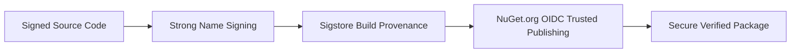

# Security Policy

## Supported Versions

Only the latest major and active minor releases receive official security patches and vulnerability updates.

| Version | Target Framework | Supported | Security Maintenance Status |
| :--- | :--- | :---: | :--- |
| **`2.0.x`** | `net10.0` (core & transports) / `netstandard2.0` (Analyzers & Generators only) | :white_check_mark: | Active support (Current GA) |
| **`1.0.x`** | `net10.0` (core & transports) / `netstandard2.0` (Analyzers & Generators only) | :white_check_mark: | Maintenance support |
| `< 1.0.0` | Any | :x: | End of Life / Unsupported pre-releases |

> **Note**: `EricksonLopez.Messaging.Abstractions`, `EricksonLopez.Messaging` (core), and all transport packages (`RabbitMQ`, `AzureServiceBus`, `AwsSqs`, `Kafka`, `Events`, `OpenTelemetry`, `Testing`) target `net10.0`. Only `EricksonLopez.Messaging.Analyzers` and `EricksonLopez.Messaging.Generators` target `netstandard2.0` (required by the Roslyn compiler infrastructure).

---

## Reporting a Vulnerability

We take the security of `EricksonLopez.Messaging` and the entire ecosystem seriously. If you identify a potential security vulnerability, please do **NOT** open a public issue or discussion.

### Private Disclosure Process

1. **Email Disclosure**: Send a detailed advisory to [ericksonlopezf@gmail.com](mailto:ericksonlopezf@gmail.com).
2. **Include Technical Details**:
   - Package name and affected version(s).
   - Minimal reproduction code or proof-of-concept (PoC).
   - Potential impact (e.g., Denial of Service, remote code execution, unhandled message interception, secret leakage).
3. **Response Timeline**:
   - **Initial Acknowledgement**: Within 48 hours.
   - **Triage & Validation**: Within 5 business days.
   - **Patch Release & Advisory**: Target within 14 calendar days depending on severity.

A security advisory and release will be published via GitHub Security Advisories upon patch validation.

---

## Supply Chain Security & Integrity

`EricksonLopez.Messaging` implements stringent DevSecOps supply chain security controls:

1. **Strong Name Signing**:
   - All assemblies are strong-name signed (`.snk`) during CI/CD release builds, ensuring binary identity and preventing assembly tampering.
2. **Sigstore Build Provenance**:
   - Release packages are signed and attested using `actions/attest-build-provenance` via GitHub Actions and Sigstore OIDC identities.
3. **NuGet OIDC Trusted Publishing**:
   - Package publishing uses short-lived OpenID Connect (OIDC) identity tokens (`NuGet/login@v1`) tied directly to GitHub Actions repository workflows, eliminating static API keys.
4. **Reproducible & Symbol-Rich Builds**:
   - SourceLink integration (`PublishRepositoryUrl`, `EmbedUntrackedSources`) and embedded `.snupkg` symbol packages provide verifiable symbol debugging.

---

## Security Boundaries & Best Practices

1. **Domain Boundary Isolation (`ELMSG005`)**:
   - Roslyn Analyzer `ELMSG005` prevents domain entities from being exposed in message contracts, mitigating unintended internal domain state leakage across network boundaries.
2. **Credential Management**:
   - Azure Service Bus transport (`EricksonLopez.Messaging.AzureServiceBus`) supports passwordless Azure Active Directory authentication via `Azure.Identity` (`DefaultAzureCredential` / `TokenCredential`) to avoid hardcoded connection strings in configuration files.
3. **Transport Security (TLS / SSL)**:
   - RabbitMQ, Kafka, Azure Service Bus, and AWS SQS transports enforce TLS 1.2+ encryption in transit. Ensure brokers and network endpoints mandate secure transport layers.
4. **Untrusted Payload Deserialization**:
   - Serializer uses `System.Text.Json` with explicit `JsonSerializerContext` (Native AOT) with type discriminators and strictly bounded type mapping, avoiding dangerous polymorphic type instantiators.