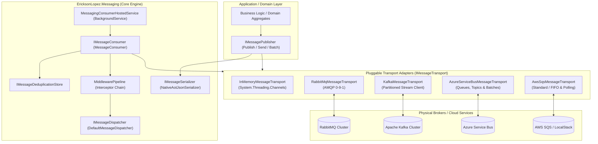
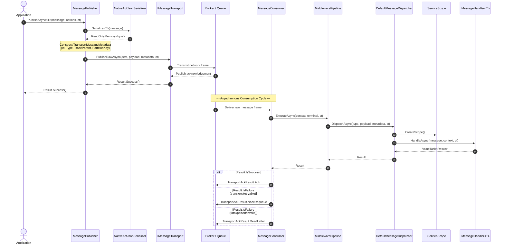
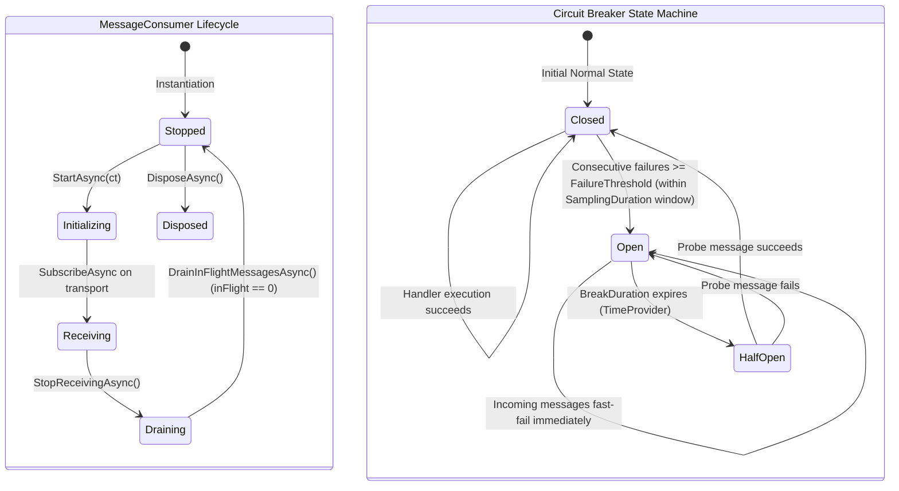
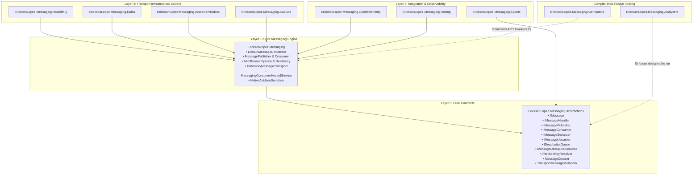
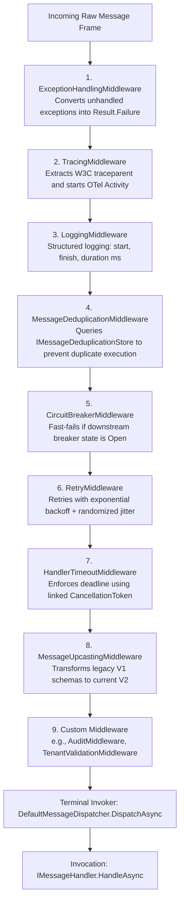
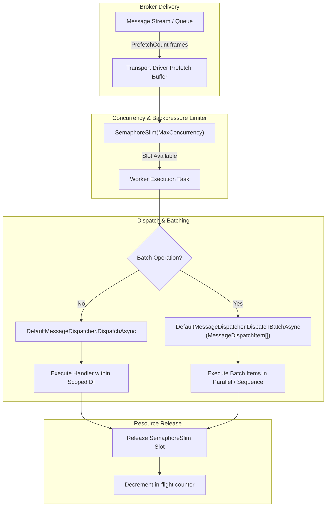
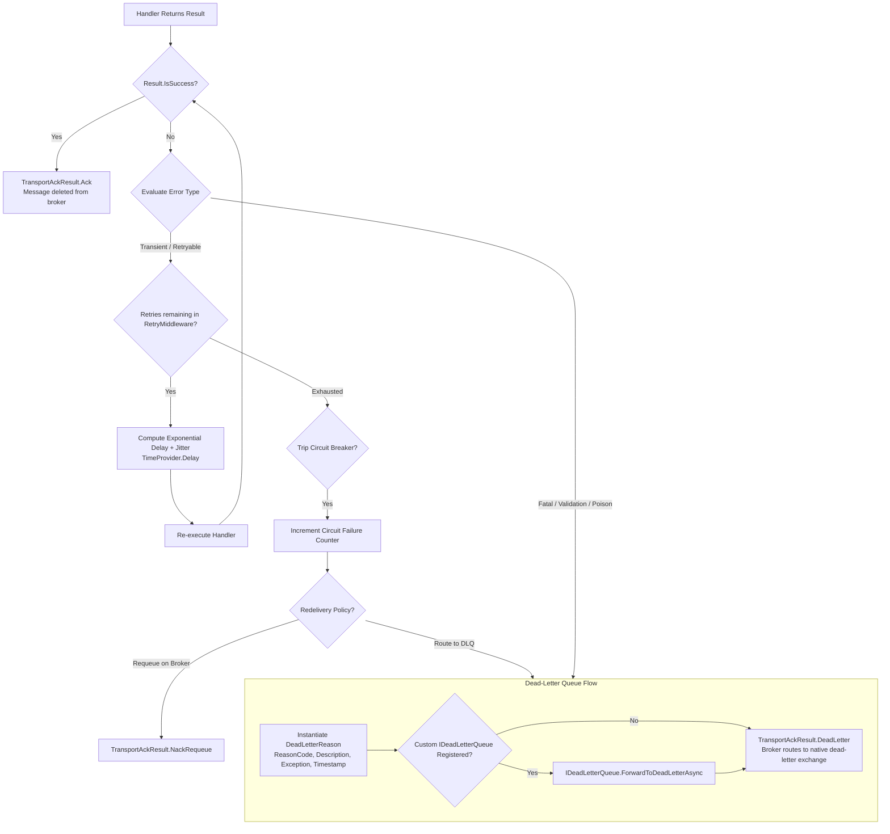

# EricksonLopez.Messaging — Architecture Blueprint & Technical Diagrams

## 1. System Overview & Core Tenets

`EricksonLopez.Messaging` is an enterprise-grade, high-throughput, distributed messaging and publish/subscribe framework designed for .NET 10 microservices and event-driven architectures. It prioritizes **Native AOT compilation**, **low-allocation hot paths**, and **functional error handling** via `Result<T>` (`EricksonLopez.Result`).

The guiding architectural tenets of the ecosystem are:
1. **Clean Layer Isolation**: Domain models and application services remain 100% agnostic of physical broker topologies, exchange types, and partition routing mechanics.
2. **Zero Runtime Reflection (Native AOT First)**: Handler discovery, invocation dispatching, and JSON serialization are resolved at compile time using Roslyn Incremental Generators (`MessagingIncrementalGenerator`) and `JsonSerializerContext`.
3. **Functional Flow Control (`Result`)**: Elimination of exceptions for expected business rejections or validation failures, preventing expensive CLR stack unwinds on hot consumer loops.
4. **Two-Way Interceptor Pipeline**: Composable Russian-doll middleware pipeline for cross-cutting concerns: resilience, auditing, distributed tracing, and contract schema evolution.
5. **High Performance & Minimal Allocations**: Pervasive utilization of `ValueTask<Result>`, `ReadOnlyMemory<byte>`, and zero-copy `IBufferWriter<byte>` pipelines.
6. **Native Observability**: Built-in adherence to OpenTelemetry Semantic Conventions v1.26+ via dedicated `ActivitySource` and `Meter` instruments.

---

## 2. Official Architectural Blueprints

### 2.1 Diagram 1: System Overview Architecture

---

### 2.2 Diagram 2: Cardinal Messaging Execution Flow

```mermaid
flowchart LR
    App[Publisher Application] -->|1. PublishAsync| Pub[MessagePublisher]
    Pub -->|2. Serialize| Ser[NativeAotJsonSerializer]
    Ser -->|3. Binary Payload| TransPub[IMessageTransport]
    TransPub -->|4. Network Frame| Broker[(Message Broker)]
    Broker -->|5. Delivery Callback| TransSub[Transport.SubscribeAsync]
    TransSub -->|6. Raw Frame Delivery| Con[MessageConsumer]
    Con -->|7. Pipeline Execution| Pipe[MiddlewarePipeline]
    Pipe -->|8. Scoped Dispatch| Disp[DefaultMessageDispatcher]
    Disp -->|9. Invocation| Handler[IMessageHandler]
    Handler -->|10. Result| Ack[TransportAckResult]
    Ack -->|11. Commit / Requeue / DLQ| Broker
```

---

### 2.3 Diagram 3: End-to-End Publish and Consume Sequence

---

### 2.4 Diagram 4: Consumer & Circuit Breaker State Machines

---

### 2.5 Diagram 5: Package and Component Dependencies

---

### 2.6 Diagram 6: Russian-Doll Middleware Pipeline

---

### 2.7 Diagram 7: Concurrency Control, Prefetching & Backpressure

---

### 2.8 Diagram 8: Error Handling, Resilience & Dead-Letter Routing

