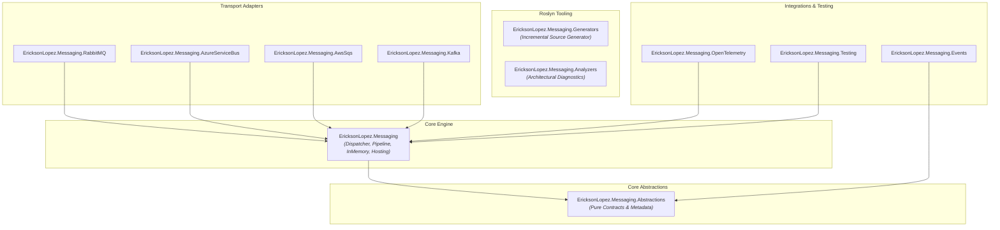
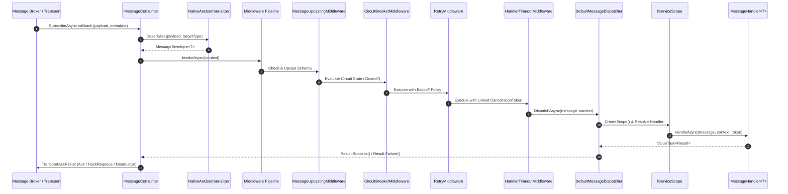

# EricksonLopez.Messaging — Architecture Blueprint

## System Overview & Core Philosophy

`EricksonLopez.Messaging` is a high-performance, low-allocation, Native AOT-first distributed messaging and publish/subscribe framework designed for modern .NET 10 applications within the **EricksonLopez** ecosystem.

It addresses the challenges of building scalable, resilient, and observable distributed systems by adhering to the following core tenets:

1. **Clean Architecture & DDD Boundary Enforcement**: Domain and application layers remain completely agnostic of physical messaging topology, exchange types, broker drivers, and serialization mechanics.
2. **Zero-Reflection & Native AOT First**: Runtime reflection lookups and dynamic code generation are completely eliminated in favor of Roslyn Incremental Generators (`MessagingIncrementalGenerator`) and compile-time `JsonSerializerContext`. `MessageTypeCache<T>` uses single-time reflection at generic type initialization only.
3. **Functional Control Flow via the Result Pattern**: Handlers return `ValueTask<Result>` (`EricksonLopez.Result`), eliminating expensive exception-based control flow for business failures and transient errors.
4. **Resilient Two-Way Middleware Pipeline**: A flexible execution pipeline encapsulating circuit breakers, execution timeouts, exponential retry policies with full-jitter randomization, exception translation, and schema upcasting.
5. **Low Allocation & High Throughput**: Uses `ValueTask<Result>`, `ReadOnlyMemory<byte>`, and `ConcurrentDictionary` on dispatch hot paths to minimize GC pressure.
6. **Observability Native**: Out-of-the-box OpenTelemetry instrumentation complying with the OpenTelemetry Messaging Semantic Conventions v1.26+.

---

## Internal Project Dependency Graph

The repository is organized into distinct layered components to maintain strict dependency isolation:



---

## Message Dispatch & Consumption Pipeline

When a message is received from a physical broker, it undergoes structured deserialization, pipeline execution, and scoped dispatching:



---

## Core Type Design & Immutability

### 1. Message Contracts (`IMessage`)
All messages within the ecosystem are represented as immutable records or classes implementing `IMessage`. Messages are identified at compile-time by `[MessageType("unique-id")]`:

```csharp
[MessageType("orders.created.v1")]
public sealed record OrderCreatedMessage(
    Guid OrderId,
    string CustomerNumber,
    decimal TotalAmount,
    DateTimeOffset CreatedAtUtc) : IMessage;
```

### 2. Message Envelope & Execution Context
- **`TransportMessageMetadata`**: Immutable carrier record containing `MessageId`, `MessageType`, `Timestamp`, `CorrelationId`, `CausationId`, `TraceParent`, `TenantId`, `PartitionKey`, `ContentType`, `SchemaVersion`, and optional `Headers`.
- **`MessageContext`**: Ambient execution context passed to `IMessageHandler<T>`, containing `Metadata`, `ServiceProvider` (scoped), `CancellationToken`, `Message` instance, and mutable `Items` dictionary for middleware state propagation.
- **`MessageEnvelope<T>`**: Strongly-typed immutable envelope pairing the typed message payload with its `MessageContext`.

---

## Resiliency Architecture & Middleware Engine

The consumer pipeline executes a chain of `IMessageMiddleware` components before invoking the message handler.

### 1. Circuit Breaker (`CircuitBreakerMiddleware`)
Protects downstream dependencies from cascading failures during outages:
- **`Closed`**: Normal operation. Failures are counted within a sliding window.
- **`Open`**: When failure threshold (e.g. 5 failures) is reached, immediately fast-fails incoming messages with `Result.Failure` without calling downstream handlers.
- **`HalfOpen`**: After the break duration (e.g. 30 seconds), allows probe executions to determine if the downstream service has recovered.

### 2. Handler Timeout (`HandlerTimeoutMiddleware`)
Prevents thread pool starvation and hung consumers by enforcing strict execution deadlines via linked cancellation tokens (`CancellationTokenSource.CreateLinkedTokenSource`).

### 3. Exponential Backoff Retry (`RetryMiddleware`)
Handles transient failures using configurable retry attempts, initial delay, and **full-jitter randomization** (`Random.Shared`) using `TimeProvider` for testable time control. This prevents thundering-herd scenarios by randomizing retry intervals across all consumers.

### 4. Message Schema Upcasting (`MessageUpcastingMiddleware`)
Provides backwards-compatible message migration at runtime:
- Registered implementations of `IMessageUpcaster` inspect `metadata.SchemaVersion`.
- If an older schema is detected, `UpcastAsync` transforms the binary payload to the latest schema version before deserialization and handler execution.

---

## Pluggable Transports Architecture

Transports implement `IMessageTransport` to provide uniform publish, send, and subscribe operations across physical brokers:

```csharp
public interface IMessageTransport
{
    ValueTask<Result> PublishRawAsync(
        string destination,
        ReadOnlyMemory<byte> payload,
        TransportMessageMetadata metadata,
        CancellationToken cancellationToken = default);

    ValueTask<Result> SubscribeAsync(
        string destination,
        Func<ReadOnlyMemory<byte>, TransportMessageMetadata, CancellationToken, ValueTask<TransportAckResult>> handler,
        TransportSubscriptionOptions? options = null,
        CancellationToken cancellationToken = default);
}
```

### Extended Transport Capabilities
- **`IDeferableMessageTransport`**: Implemented by transports supporting delayed delivery (`DeferRawAsync`) such as Azure Service Bus (Scheduled Messages), AWS SQS (Message Delay), and In-Memory (`InMemoryMessageTransport` via `Task.Delay` and `TimeProvider`).
- **`IBatchMessageTransport`**: Implemented by transports supporting native batch publishing (`PublishBatchRawAsync`) such as Azure Service Bus (`ServiceBusMessageBatch`) and In-Memory (`InMemoryMessageTransport`).

---

## Native AOT & Zero-Reflection Mechanics

To guarantee 100% Native AOT trimming compatibility without runtime warnings (`IL2026`, `IL3050`):

1. **`MessagingIncrementalGenerator`**:
   - Analyzes all classes implementing `IMessageHandler<T>` in the compilation.
   - Extracts their `[MessageType]` attribute values.
   - Emits `GeneratedMessagingServiceCollectionExtensions.g.cs` containing strongly-typed `AddMessageHandler<T, H>()` registrations.
   - Emits `GeneratedMessagingJsonSerializerContext.g.cs` inheriting from `JsonSerializerContext` with `[JsonSerializable(typeof(T))]` for all discovered message types.
2. **`NativeAotJsonSerializer`**:
   - Resolves serialization metadata strictly via `JsonTypeInfo<T>` without invoking reflection-based `System.Text.Json` overloads.
