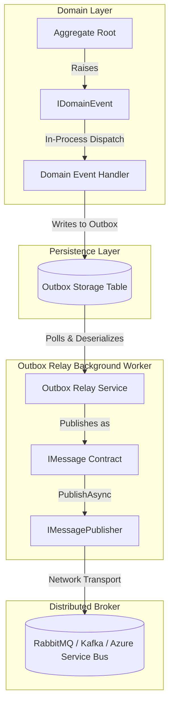

# Ecosystem Integration Guide

This guide details how `EricksonLopez.Messaging` integrates with other core architectural building blocks in the **EricksonLopez** .NET ecosystem, including `EricksonLopez.Events`, `EricksonLopez.Mediator`, `EricksonLopez.Outbox`, and `EricksonLopez.Result`.

---

## Architectural Responsibility Matrix

To prevent architectural overlap and maintain strict Clean Architecture boundaries, the ecosystem defines distinct responsibilities across specialized libraries:

```text
┌─────────────────────────────────────────────────┬────────────────────────────────────────────────────────┐
│ IN-PROCESS (SYNCHRONOUS / SAME DB TRANSACTION)   │ DISTRIBUTED (CROSS-BOUNDARY / NETWORK BROKERS)         │
├─────────────────────────────────────────────────┼────────────────────────────────────────────────────────┤
│ • EricksonLopez.Mediator                        │ • EricksonLopez.Messaging                              │
│   (In-Process Commands, Queries, CQRS pipelines)│   (Distributed Pub/Sub, Work Queues, Broker Transports)│
│ • EricksonLopez.EventBus / Events               │ • EricksonLopez.Outbox                                 │
│   (In-Process Domain Event notifications)       │   (Guaranteed At-Least-Once Transactional Relay)       │
└─────────────────────────────────────────────────┴────────────────────────────────────────────────────────┘
```

| Concern | `EricksonLopez.Events` | `EricksonLopez.Mediator` | `EricksonLopez.Outbox` | `EricksonLopez.Messaging` |
| :--- | :--- | :--- | :--- | :--- |
| **Execution Scope** | In-Process (Local thread/task) | In-Process (Local thread/task) | In-Process to Storage | Out-of-Process (Network Broker) |
| **Primary Abstraction** | `IEventPublisher`, `IEvent` | `IMediator`, `ICommand<T>`, `IQuery<T>` | `IOutboxStore`, `IOutboxRelay` | `IMessagePublisher`, `IMessageConsumer` |
| **Transaction Boundary** | Same DB transaction | Same DB transaction | Enlists in DB transaction | Independent transport session |
| **Network Protocol** | None (Direct method invoke) | None (Direct method invoke) | Database SQL/Driver | AMQP, Kafka, SQS, Azure Service Bus |
| **Error Handling** | Synchronous exceptions / Result | `Result<T>` / Pipeline behaviors | Persistent Retry Engine | `ValueTask<Result>` / Resiliency Middleware |

---

## 1. Messaging vs Events Boundary (ADR-002)

A fundamental rule of this ecosystem is the strict boundary between domain events and distributed messaging:

- **`EricksonLopez.Events` (Domain Events)**:
  - Expresses domain facts within an Aggregate Root boundary (e.g. `OrderPlacedDomainEvent`).
  - Dispatched synchronously in-memory within the domain/application layer.
  - Must remain 100% agnostic of physical topics, exchanges, and serialization formats.
- **`EricksonLopez.Messaging` (Distributed Messages)**:
  - Carries integration messages and work commands across microservice and bounded context boundaries.
  - Implements network serialization, transport drivers, broker acknowledgements, and dead-letter routing.

### Integration Flow with Outbox and Events Bridge



---

## 2. Unidirectional Event Bridge (`EricksonLopez.Messaging.Events`)

For applications that need to publish domain/integration events directly across message brokers without boilerplate mapping code, the `EricksonLopez.Messaging.Events` package provides an adapter implementation of `IEventPublisher`:

```csharp
using Microsoft.Extensions.DependencyInjection;
using EricksonLopez.Messaging.Events;

// Register Messaging Event Publisher Bridge
builder.Services.AddMessagingEventPublisher(options =>
{
    // ThrowOnFailure: true (default) rethrows publish errors as exceptions.
    options.ThrowOnFailure = false;

    // DestinationResolver: maps domain event types to distributed message destinations
    options.DestinationResolver = eventType => $"{eventType.Name.ToLowerInvariant()}.events.v1";
});
```

When `IEventPublisher.PublishAsync(event)` is invoked, `MessagingEventPublisher`:
1. Wraps the event payload into an `IMessage` envelope.
2. Extracts metadata and correlation IDs.
3. Forwards the message to `IMessagePublisher.PublishAsync()`.

---

## 3. Functional Control Flow with `EricksonLopez.Result`

The entire `EricksonLopez.Messaging` pipeline is designed around the **Result Pattern** ([ADR-008](adr/adr-008-result-pattern-integration.md)):

```csharp
public sealed class ProcessPaymentHandler : IMessageHandler<ProcessPaymentCommand>
{
    public async ValueTask<Result> HandleAsync(
        ProcessPaymentCommand message,
        MessageContext context,
        CancellationToken cancellationToken = default)
    {
        if (message.Amount <= 0)
        {
            // Non-retryable business validation error
            return Result.Failure(Error.Validation("Payment.InvalidAmount", "Payment amount must be positive."));
        }

        var processingResult = await ExecutePaymentAsync(message, cancellationToken);
        if (processingResult.IsFailure)
        {
            // Business failure
            return processingResult;
        }

        return Result.Success();
    }
}
```

### Advantages of the Result Pattern in Messaging:
- **Predictable Error Classification**: Middlewares distinguish between business failures (e.g. `Error.Validation`) which are acknowledged and dead-lettered, vs infrastructure failures (e.g. `Error.Failure`) which trigger retries.
- **Zero Exception Overhead**: Eliminates stack trace generation costs on hot consumer dispatch paths.
- **Compile-Time Enforcement**: Roslyn Analyzer `ELMSG010` ensures all message handlers explicitly return `ValueTask<Result>`.

---

## 4. Architectural Invariants Enforced by Roslyn Analyzers

To guarantee Clean Architecture compliance:

1. **No Domain Entity Leaks (`ELMSG005`)**: Message contracts must only contain primitive types, records, or DTOs. Domain entity types (e.g., aggregate roots, entities) are forbidden in message definitions.
2. **Scoped Handler Lifetimes (`ELMSG004`)**: Handlers must be registered as `Scoped` so that every received message runs within an isolated `IServiceScope`.
3. **Pure Asynchronous Handlers (`ELMSG008`)**: Handlers must not perform synchronous blocking (`.Result`, `.Wait()`) to prevent thread pool starvation under high messaging volume.
