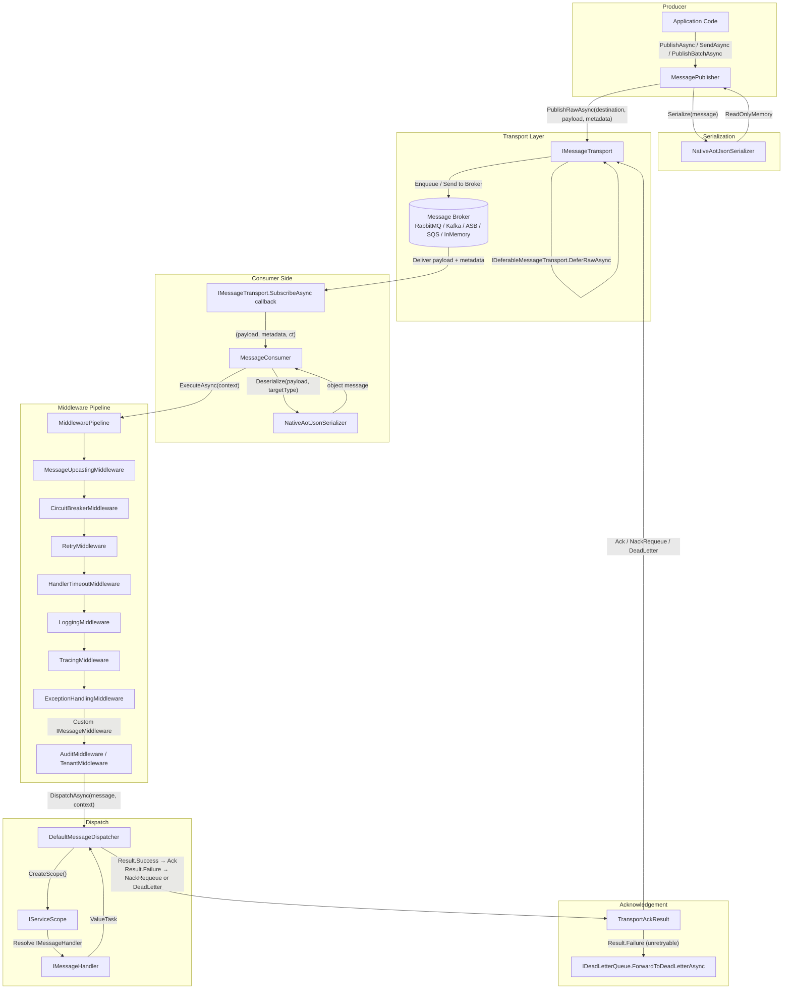
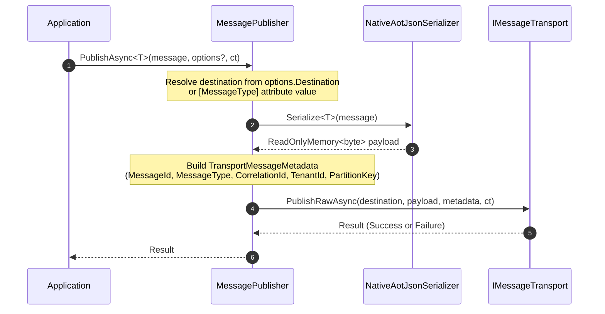
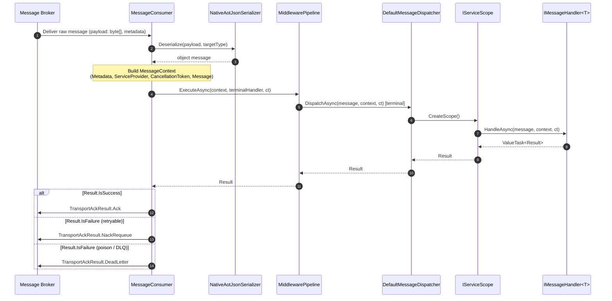
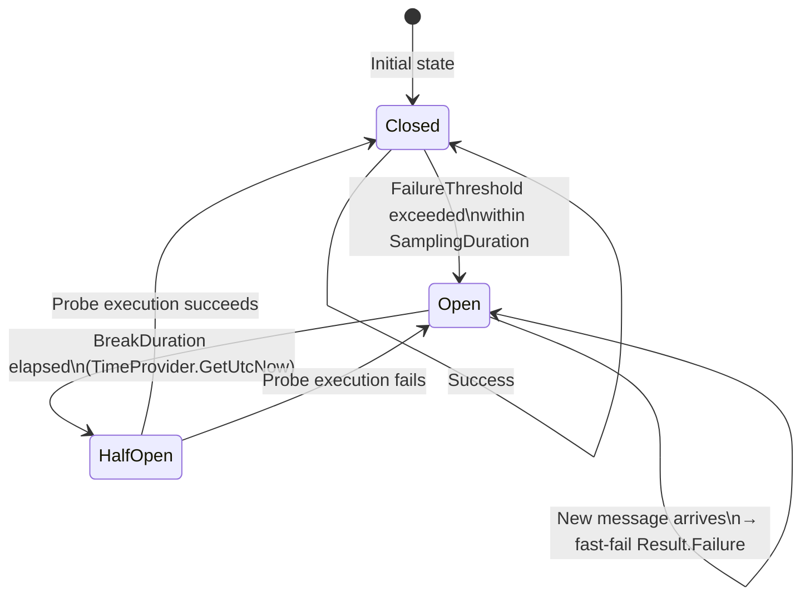
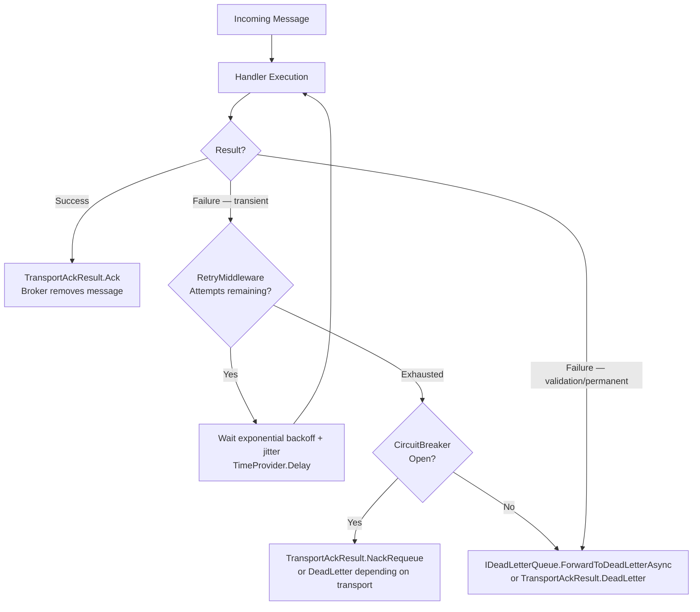

# Functional Map — EricksonLopez.Messaging

This document maps the complete functional execution flow of the library from message publication to handler acknowledgement.

---

## 1. Component Interaction Overview



---

## 2. Publish Path (Entry Point → Transport)



---

## 3. Consume Path (Transport → Handler → Ack)



---

## 4. Circuit Breaker State Machine



---

## 5. Middleware Pipeline Execution Order

```mermaid
flowchart LR
    In[Incoming Message] --> E[ExceptionHandlingMiddleware\nouter: catches all throws]
    E --> T[TracingMiddleware\nW3C traceparent propagation]
    T --> L[LoggingMiddleware\nstructured log: start/end/duration]
    L --> CB[CircuitBreakerMiddleware\nfast-fail when Open]
    CB --> R[RetryMiddleware\nexp. backoff + full-jitter]
    R --> TO[HandlerTimeoutMiddleware\nlinked CancellationToken]
    TO --> U[MessageUpcastingMiddleware\nschema V1→V2 transformation]
    U --> Custom[Custom IMessageMiddleware\n(AuditMiddleware, TenantMiddleware...)]
    Custom --> D[DefaultMessageDispatcher\nscoped handler resolution]
    D --> Out[IMessageHandler<T>.HandleAsync]
```

> **Note**: AddMessaging() registers TracingMiddleware, LoggingMiddleware, and ExceptionHandlingMiddleware automatically. Additional middleware is registered via MessagingOptionsBuilder.

---

## 6. Error Handling Flow



---

## 7. Layer Responsibilities

| Layer | Components | Responsibility |
|---|---|---|
| **Entry Point** | IMessagePublisher.PublishAsync, SendAsync, PublishBatchAsync, SendBatchAsync | Accept typed messages from application code |
| **Serialization** | NativeAotJsonSerializer, IMessageSerializer | Bidirectional byte serialization via JsonSerializerContext |
| **Transport** | IMessageTransport, IBatchMessageTransport, IDeferableMessageTransport | Physical delivery to/from broker |
| **Consumer** | MessageConsumer, MessagingConsumerHostedService | Subscription lifecycle and raw payload receipt |
| **Middleware Pipeline** | MiddlewarePipeline, IMessageMiddleware, MessageExecutionDelegate | Cross-cutting: resiliency, logging, tracing, upcasting |
| **Dispatch** | DefaultMessageDispatcher, IMessageDispatcher | Scoped resolution and typed handler invocation |
| **Handler** | IMessageHandler<TMessage> | Business logic; returns ValueTask<Result> |
| **Acknowledgement** | TransportAckResult (Ack / NackRequeue / DeadLetter) | Signal to broker to commit, requeue, or dead-letter |
| **Dead Letter** | IDeadLetterQueue, DeadLetterReason | Poison message routing and forensics |
