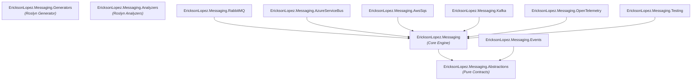

# NuGet Package Ecosystem & Developer Guide

This document describes the package ecosystem, Central Package Management (CPM), compatibility matrices, sample applications, and benchmark suites for `EricksonLopez.Messaging`.

---

## 1. Produced NuGet Packages

The solution produces 11 individual NuGet packages targeting `.NET 10.0` and `.NET Standard 2.0`:

| Package ID | Target Framework | IsPackable | Description |
| :--- | :--- | :---: | :--- |
| **`EricksonLopez.Messaging.Abstractions`** | `net10.0` | `true` | Pure contracts, interfaces, attributes, and transport metadata. |
| **`EricksonLopez.Messaging`** | `net10.0` | `true` | Core messaging engine: dispatcher, middleware pipeline, in-memory transport, and DI. |
| **`EricksonLopez.Messaging.Generators`** | `netstandard2.0` | `true` | Roslyn Incremental Generator for zero-reflection handler discovery and `JsonSerializerContext`. |
| **`EricksonLopez.Messaging.Analyzers`** | `netstandard2.0` | `true` | Roslyn Architectural Analyzers (`ELMSG002`, `ELMSG004`, `ELMSG005`, `ELMSG008`, `ELMSG010`). |
| **`EricksonLopez.Messaging.RabbitMQ`** | `net10.0` | `true` | AMQP 0-9-1 transport driver for RabbitMQ. |
| **`EricksonLopez.Messaging.AzureServiceBus`** | `net10.0` | `true` | Azure Service Bus transport driver supporting Managed Identity, batching, and deferral. |
| **`EricksonLopez.Messaging.AwsSqs`** | `net10.0` | `true` | AWS SQS transport driver supporting Standard and FIFO queues. |
| **`EricksonLopez.Messaging.Kafka`** | `net10.0` | `true` | Apache Kafka transport driver with partition key routing and consumer groups. |
| **`EricksonLopez.Messaging.Events`** | `net10.0` | `true` | Integration bridge implementing `IEventPublisher` backed by messaging transports. |
| **`EricksonLopez.Messaging.OpenTelemetry`** | `net10.0` | `true` | OpenTelemetry Semantic Conventions v1.26+ tracing and metrics instrumentation. |
| **`EricksonLopez.Messaging.Testing`** | `net10.0` | `true` | Testing harness with `InMemoryTestHarness` and message tracking lists. |

---

## 2. Package Dependency Graph



---

## 3. Central Package Management (CPM) Dependencies

All package versions are centrally managed in `Directory.Packages.props`:

| Dependency Group | Package Name | Pinned Version | Consumed By |
| :--- | :--- | :--- | :--- |
| **Core & Extensions** | `Microsoft.Extensions.DependencyInjection.Abstractions` | `9.0.2` | Core, Events |
| | `Microsoft.Extensions.DependencyInjection` | `9.0.2` | Core, Sample, Benchmarks |
| | `Microsoft.Extensions.Logging.Abstractions` | `9.0.2` | Core |
| | `Microsoft.Extensions.Logging` | `9.0.2` | Core |
| | `Microsoft.Extensions.Logging.Console` | `9.0.2` | Sample |
| | `Microsoft.Extensions.Hosting.Abstractions` | `9.0.2` | Core |
| | `Microsoft.Extensions.Hosting` | `9.0.2` | Sample |
| | `Microsoft.Extensions.Options` | `9.0.2` | Core |
| | `Microsoft.Extensions.Diagnostics.HealthChecks.Abstractions` | `9.0.2` | Core |
| | `EricksonLopez.Result` | `1.0.0` | Abstractions |
| | `EricksonLopez.Events.Contracts` | `1.0.0` | Events |
| **Brokers & Cloud** | `RabbitMQ.Client` | `7.1.1` | RabbitMQ |
| | `Azure.Messaging.ServiceBus` | `7.18.4` | AzureServiceBus |
| | `Azure.Identity` | `1.13.2` | AzureServiceBus |
| | `Confluent.Kafka` | `2.8.0` | Kafka |
| | `AWSSDK.SQS` | `3.7.400.77` | AwsSqs |
| **Observability** | `OpenTelemetry` | `1.11.2` | OpenTelemetry |
| | `OpenTelemetry.Api` | `1.17.0` | OpenTelemetry |
| | `OpenTelemetry.Extensions.Hosting` | `1.17.0` | Sample |
| | `OpenTelemetry.Exporter.Console` | `1.11.2` | Sample |

> **⚠️ Note**: A version divergence exists between `OpenTelemetry` / `OpenTelemetry.Exporter.Console` (`1.11.2`) and `OpenTelemetry.Api` / `OpenTelemetry.Extensions.Hosting` (`1.17.0`). These are pinned separately in `Directory.Packages.props`. See [Technical Debt](technical-debt.md) for the remediation tracking item.

| **Roslyn Tooling** | `Microsoft.CodeAnalysis.CSharp` | `4.8.0` | Analyzers, Generators |
| | `Microsoft.CodeAnalysis.Analyzers` | `3.3.4` | Analyzers, Generators |
| | `Microsoft.CodeAnalysis.Common` | `4.8.0` | Transitive (via `Microsoft.CodeAnalysis.CSharp`) |
| **Testing & Benchmarks** | `Microsoft.NET.Test.Sdk` | `17.14.1` | All Test Projects |
| | `xunit` | `2.9.3` | All Test Projects |
| | `xunit.runner.visualstudio` | `3.0.2` | All Test Projects |
| | `coverlet.collector` | `6.0.4` | All Test Projects |
| | `AwesomeAssertions` | `9.5.0` | All Test Projects |
| | `NSubstitute` | `6.2.0` | All Test Projects |
| | `FsCheck.Xunit` | `3.3.4` | All Test Projects |
| | `BenchmarkDotNet` | `0.14.0` | Benchmarks |

---

## 4. Transport Feature Comparison Matrix

| Feature / Capability | In-Memory | RabbitMQ | Azure Service Bus | AWS SQS | Apache Kafka |
| :--- | :---: | :---: | :---: | :---: | :---: |
| **Publish (`PublishRawAsync`)** | :white_check_mark: | :white_check_mark: | :white_check_mark: | :white_check_mark: | :white_check_mark: |
| **Subscribe (`SubscribeAsync`)** | :white_check_mark: | :white_check_mark: | :white_check_mark: | :white_check_mark: | :white_check_mark: |
| **Batch Publishing (`IBatchMessageTransport`)** | :white_check_mark: | Fallback | :white_check_mark: | Fallback | Fallback |
| **Scheduled Deferral (`IDeferableMessageTransport`)** | :white_check_mark: | DLX Delay | :white_check_mark: | :white_check_mark: | :x: |
| **Partition Key Routing (`[PartitionKey]`)** | :x: | Routing Key | PartitionKey / SessionId | MessageGroupId (FIFO) | Partition Key |
| **Passwordless Auth (Managed Identity)** | N/A | :x: | :white_check_mark: | IAM Roles | SASL / IAM |
| **Dead-Letter Handling** | In-Memory DLQ | `x-dead-letter-exchange` | Native DLQ | Native Redrive Policy | Dead Letter Topic |
| **Native AOT Compatible** | :white_check_mark: | :white_check_mark: | :white_check_mark: | :white_check_mark: | :white_check_mark: |

---

## 5. Sample Application

The repository includes a runnable sample in `samples/EricksonLopez.Messaging.Sample`:

```bash
# Run the sample console application
dotnet run --project samples/EricksonLopez.Messaging.Sample/EricksonLopez.Messaging.Sample.csproj
```

### Highlights Demonstrated in Sample:
1. Registration of messaging pipeline with `AddMessaging()`.
2. Manual and source-generated handler registration with `AddMessageHandler<T, H>()`.
3. OpenTelemetry distributed tracing with console exporter.
4. Typed message publishing and async scoped handler execution.

---

## 6. Benchmarks Suite

The benchmark project lives in `benchmarks/EricksonLopez.Messaging.Benchmarks` and measures memory allocations and execution latency across dispatch hot paths using BenchmarkDotNet:

```bash
# Execute benchmarks in Release configuration
dotnet run --project benchmarks/EricksonLopez.Messaging.Benchmarks/EricksonLopez.Messaging.Benchmarks.csproj -c Release
```

### Measured Invariants:
- **Low-Allocation Dispatch**: Verifies `ValueTask<Result>` hot-path and `ConcurrentDictionary` O(1) handler lookup via `DefaultMessageDispatcher`.
- **Serialization Throughput**: Evaluates `NativeAotJsonSerializer` speed against reflection-based alternatives.
