# Level 00: Architectural Introduction & Mental Model

## 1. Overview & Problem Statement
In distributed cloud architectures, event-driven messaging across disparate message brokers (RabbitMQ, Kafka, Azure Service Bus, AWS SQS) introduces significant challenges:
- **Broker Lock-In**: Inconsistent abstractions force vendor-specific code into business domain layers.
- **Serialization Bottlenecks**: Heavy reflection-based serializers consume high CPU and heap allocations.
- **Observability Gaps**: Missing or fragmented OpenTelemetry context propagation prevents end-to-end distributed tracing.

`EricksonLopez.Messaging` provides a **Unified, Zero-Allocation Messaging Backbone**:
- **Broker-Agnostic Abstractions**: Clean interface for publishing, subscribing, and stream processing.
- **100% Native AOT & Trimming Compliant**: Powered by `System.Text.Json` source generation and zero-reflection pipelines.
- **Native OpenTelemetry Instrumentation**: Distributed trace propagation following W3C Trace Context standards.

---

## 2. Messaging Pipeline Architecture

```mermaid
graph LR
    Producer[Event Producer] --> Middleware[Message Middleware Pipeline]
    Middleware --> Serializer[Source-Generated Serializer]
    Serializer --> Transport[Broker Transport Adapter]
    Transport -->|RabbitMQ / Kafka / ASB / SQS| Broker[(Message Broker)]
    Broker --> ConsumerTransport[Broker Consumer]
    ConsumerTransport --> Tracing[OpenTelemetry Activity Span]
    Tracing --> Handler[Domain Event Handler]
```

---

## 3. High-Level Comparison

| Capability | MassTransit | Rebus | EricksonLopez.Messaging |
|---|---|---|---|
| **Native AOT Compatible** | ❌ Reflection heavy | ⚠️ Partial | ✅ **100% Guaranteed Native AOT** |
| **Pipeline Memory Profile** | High | Moderate | **Zero Heap Allocations on Hot Path** |
| **OpenTelemetry Standard** | Custom Activity | Custom Tracing | **W3C TraceContext Semantic Conventions** |
