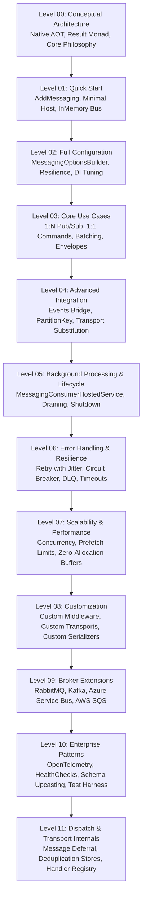

# Progressive Showcase Reference Guide (Levels 00 to 11)

This document serves as the canonical curriculum and reference guide for the [EricksonLopez.Messaging.Sample](../../samples/EricksonLopez.Messaging.Sample/Program.cs) reference project. Each level illustrates a progressive architectural tier of the framework using exclusively verified public APIs.

---

## Progressive Learning Curriculum

---

### Level 00 — Conceptual Architecture
- **Detailed Guide**: [level-00-introduction.md](level-00-introduction.md)
- **Purpose**: Understand the framework's architectural principles, design goals, and value proposition.
- **Core Tenets**:
  - Zero runtime reflection lookups (`Type.GetType`, `MethodInfo.Invoke`).
  - Functional railway control flow via `Result` / `ValueTask<Result>` (`EricksonLopez.Result`).
  - Unified transport abstraction across diverse broker topologies.
- **Reference Code**: [Program.cs](../../samples/EricksonLopez.Messaging.Sample/Program.cs#L95-L149).

---

### Level 01 — Quick Start
- **Detailed Guide**: [level-01-event-bus-and-transports.md](level-01-event-bus-and-transports.md)
- **Purpose**: Launch a minimal working pub/sub bus in three lines of code with zero external infrastructure.
- **Key APIs Demonstrated**:
  - `builder.Services.AddMessaging()`
  - `builder.Services.AddMessageHandler<PingMessage, PingHandler>()`
  - `IMessagePublisher.PublishAsync(message)`
- **Reference Code**: [Program.cs](../../samples/EricksonLopez.Messaging.Sample/Program.cs#L151-L186).

---

### Level 02 — Full Configuration
- **Detailed Guide**: [level-02-middleware-and-telemetry.md](level-02-middleware-and-telemetry.md)
- **Purpose**: Configure resiliency options, concurrency tuning, and health checks via the fluent builder.
- **Key APIs Demonstrated**:
  - `MessagingOptionsBuilder`: `AddCircuitBreaker`, `AddHandlerTimeout`, `AddRetry`, `AddUpcasting`, `AddDeduplication`, `ConfigureConsumer`.
  - `services.AddMessagingHealthCheck()`
  - `InMemoryTransportOptions` and `TransportSubscriptionOptions`.
- **Reference Code**: [Program.cs](../../samples/EricksonLopez.Messaging.Sample/Program.cs#L188-L329).

---

### Level 03 — Core Use Cases
- **Detailed Guide**: [level-03-zero-allocation-aot.md](level-03-zero-allocation-aot.md)
- **Purpose**: Model the four fundamental messaging patterns in distributed event-driven systems.
- **Key APIs Demonstrated**:
  - `PublishAsync<T>` (1:N publish/subscribe with `MessagePublishOptions`).
  - `SendAsync<T>` (1:1 point-to-point command routing with `MessageSendOptions`).
  - `PublishBatchAsync<T>` (High-throughput bulk publication).
  - `SendBatchAsync<T>` (Bulk command transmission).
  - `MessageEnvelope<T>.Create` (Explicit carrier pairing payload with `TransportMessageMetadata`).
- **Reference Code**: [Program.cs](../../samples/EricksonLopez.Messaging.Sample/Program.cs#L331-L489).

---

### Level 04 — Advanced Integration
- **Detailed Guide**: [level-04-advanced-integration.md](level-04-advanced-integration.md)
- **Purpose**: Bridge in-process domain events to the distributed bus and dynamic transport substitution.
- **Key APIs Demonstrated**:
  - `MessagingEventPublisher` bridging `IEventPublisher` (`EricksonLopez.Events.Contracts`).
  - `[PartitionKey]` attribute and dynamic runtime resolver extraction.
  - Direct dispatch via `IMessageDispatcher.DispatchAsync`.
- **Reference Code**: [Program.cs](../../samples/EricksonLopez.Messaging.Sample/Program.cs#L491-L561).

---

### Level 05 — Background Processing & Lifecycle
- **Detailed Guide**: [level-05-background-processing-and-lifecycle.md](level-05-background-processing-and-lifecycle.md)
- **Purpose**: Master asynchronous hosted consumer startup, background processing, and graceful draining.
- **Key APIs Demonstrated**:
  - `MessagingConsumerHostedService`
  - `IMessageConsumer.DrainInFlightMessagesAsync`
  - `IMessageConsumer.StopReceivingAsync`
- **Reference Code**: [Program.cs](../../samples/EricksonLopez.Messaging.Sample/Program.cs#L563-L622).

---

### Level 06 — Error Handling & Resilience
- **Detailed Guide**: [level-06-error-handling-and-resilience.md](level-06-error-handling-and-resilience.md)
- **Purpose**: Handle transient and fatal failures gracefully without uncaught exceptions or poison retry loops.
- **Key APIs Demonstrated**:
  - `Result.Failure(Error.Validation(...))` vs `Result.Failure(Error.Failure(...))`.
  - `RetryMiddleware` with exponential backoff and randomized full jitter.
  - `CircuitBreakerMiddleware` (state transitions: `Closed`, `Open`, `HalfOpen`).
  - `IDeadLetterQueue` and `DeadLetterReason.FromException`.
- **Reference Code**: [Program.cs](../../samples/EricksonLopez.Messaging.Sample/Program.cs#L624-L800).

---

### Level 07 — Scalability & Performance
- **Detailed Guide**: [level-07-scalability-and-performance.md](level-07-scalability-and-performance.md)
- **Purpose**: Fine-tune throughput, concurrency limits, prefetch batching, and buffer utilization.
- **Key APIs Demonstrated**:
  - `MessageConsumerOptions`: `MaxConcurrency`, `PrefetchCount`, `UnhandledFailureAckResult`.
  - Zero-allocation payload serialization via `IBufferWriter<byte>`.
- **Reference Code**: [Program.cs](../../samples/EricksonLopez.Messaging.Sample/Program.cs#L801-L900).

---

### Level 08 — Customization
- **Detailed Guide**: [level-08-customization.md](level-08-customization.md)
- **Purpose**: Implement custom pipeline interceptors, custom transport adapters, and custom serializers.
- **Key APIs Demonstrated**:
  - Custom `IMessageMiddleware` (`AuditMiddleware`).
  - Custom `IMessageTransport` implementation.
  - Custom `IMessageSerializer` with direct byte writer support.
- **Reference Code**: [Program.cs](../../samples/EricksonLopez.Messaging.Sample/Program.cs#L901-L1050).

---

### Level 09 — Broker Extensions
- **Detailed Guide**: [level-09-broker-extensions.md](level-09-broker-extensions.md)
- **Purpose**: Configure production cloud broker transport drivers.
- **Key APIs Demonstrated**:
  - `services.AddRabbitMqMessagingTransport(...)`
  - `services.AddKafkaMessagingTransport(...)`
  - `services.AddAzureServiceBusMessagingTransport(...)`
  - `services.AddAwsSqsMessagingTransport(...)`
- **Reference Code**: [Program.cs](../../samples/EricksonLopez.Messaging.Sample/Program.cs#L1051-L1200).

---

### Level 10 — Enterprise Patterns
- **Detailed Guide**: [level-10-enterprise-patterns.md](level-10-enterprise-patterns.md)
- **Purpose**: Enterprise-grade observability, schema evolution, dynamic partitioning, and integration testing.
- **Key APIs Demonstrated**:
  - OpenTelemetry tracing and metrics: `AddMessagingInstrumentation()`.
  - Schema upcasting: `AddMessageUpcaster<TOld, TNew, TUpcaster>()`.
  - `IPartitionKeyResolver` dynamic partition resolution.
  - Deterministic in-memory testing via `InMemoryTestHarness`.
- **Reference Code**: [Program.cs](../../samples/EricksonLopez.Messaging.Sample/Program.cs#L1201-L1380).

---

### Level 11 — Dispatch & Transport Internals
- **Detailed Guide**: [level-11-internals.md](level-11-internals.md)
- **Purpose**: Understand internal dispatch mechanics, deduplication stores, and message deferral.
- **Key APIs Demonstrated**:
  - `IDeferableMessageTransport.DeferRawAsync`
  - `IMessageDeduplicationStore` (`TryAcquireAsync`, `ReleaseAsync`)
  - `MiddlewarePipeline.BuildChain`
  - `IHandlerRegistry` and `DefaultMessageDispatcher.HandlerBinding`
- **Reference Code**: [Program.cs](../../samples/EricksonLopez.Messaging.Sample/Program.cs#L1381-L1550).
